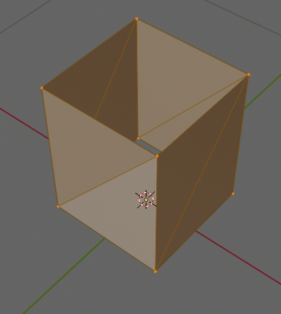
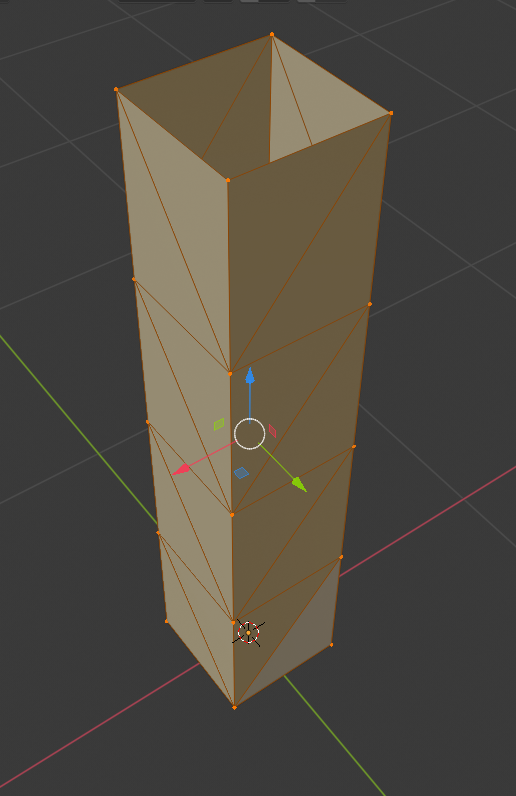
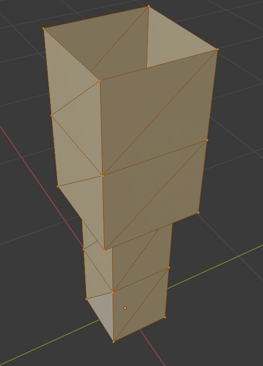
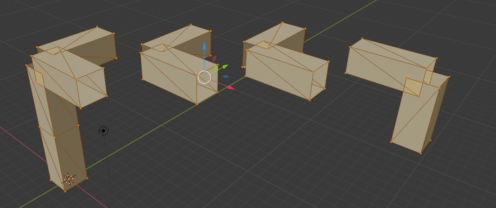

```{r include=FALSE}
knitr::opts_chunk$set(message = F)
```


Strategy: Implement algorithm in *Design Gene Representations for Emergent Innovative Design*, and then explore the 'shape space' around it using novelty search. Goals:

- Understand the issues in genomic representation of shapes
- Understand novelty search
- Find the 'adjacent possible' to a designed shape


# Making the first shape

Here, we interpret a single 'unit' of shapes by interpreting a minimal gene group. We then parse this and build the stl file to represent the shape:


```{r echo=TRUE, message=FALSE}
source("../shapevol1/R/sgene.R")
source("../shapevol1/R/genetostl.R")

gene3 <- sgene("DirectionZ",          1,status = T,start=0.0,stop=0.45,dom=1)
gene4 <- sgene("Cross section","Square",status = T,start=0.0,stop=1.5 ,dom=1)
gene5 <- sgene("Length",            0.5,status = T,start=0.0,stop=1.5 ,dom=1)
gene6 <- sgene("Diameter",          0.2,status = T,start=0.0,stop=1.5 ,dom=1)
group1 <- rbind(gene3,gene4,gene5,gene6)

genetostlfile("~/Desktop/stl/shape1.stl",group1,runlim=1)
```

Note that this is a slightly cut-down version of the miminal design seed described in section 2.2 of the paper. 
The resulting STL file can be loaded into blender to give the following shape:



Note that we aren't spending too much time on getting things like wall thickness right here because we are mainly interested in exploring how these seed grammars work under evolution. 
    
    
# Algorithm in the paper

The algorithm in the paper works like this: 

    
    

# Growing seed 1

What's missing from the above is the iterative interpretation of the seed gene. Let's look at how this works:

1. The current shape is interpreted from the status,start,stop and dominance components of each gene, and the current position of the growth.
2. If a shape is available
    1. The shape is rendered (or "grown")
    2. The position is updated
    3. Return to the top of the loop
3. Otherwise terminate    

Using this, we can grow the seed: 


```{r echo=TRUE, message=FALSE}
source("../shapevol1/R/sgene.R")
source("../shapevol1/R/genetostl.R")
gene1 <- sgene("DirectionX",          0,status = T,start=0.0,stop=1.5,dom=1)
gene2 <- sgene("DirectionY",          0,status = T,start=0.0,stop=1.5,dom=1)
gene3 <- sgene("DirectionZ",          1,status = T,start=0.0,stop=1.5,dom=1)
gene4 <- sgene("Cross section","Square",status = T,start=0.0,stop=1.5,dom=1)
gene5 <- sgene("Length",            0.5,status = T,start=0.0,stop=1.5,dom=1)
gene6 <- sgene("Diameter",          0.2,status = T,start=0.0,stop=1.5,dom=1)

group1 <- rbind(gene1,gene2,gene3,gene4,gene5,gene6)

genetostlfile   ("~/Desktop/stl/gene1.stl",group1,runlim=10)
```

This gives output as 





## Growing seed 2

Based on the above, we can grow the seed now and check the dominance for switching between genes. The original paper had the following two genes to illustrate dominance: 

    gene4 = [Cross section, Circle, 1, 0.0, 1.5, 0]
    gene7 = [Cross section, Square, 1, 0.0, 0.5, 1] 

Here the cross section changes from shape to square. The `start` position is the same for both genes, but the `stop` position changes: Gene 7 stops at position 0.5 and gene4 stops at 1.5. Where both genes are in range, between 0.0 and 0.5, the dominance of gene7 means this one is expressed. 

The original paper highlights the hierarchy of processing as follows:

1. **ACTIVE** - the gene must be active to have an effect on the current iteration. It is not clear how the active status changes while the seed is grown
2. **START / STOP** - these refer to the spatial range in which the gene takes effect. At present, this is assumed to be *absolute* position. Note also it isn't clear which XYZ direction the spatial range refers to. I guess we can assume that the value has to be within the range of the *current* direction, but this may be problematic if more than one direction is specified. 
3. **DOMINANCE** - if multiple genes are still active for a particular trait, then the trait with the highest dominance value will be used. Note that the domiance value must be unique - which will make it harder to evolve since we'll have to do a permutation of available values, not a mutation. 

Below we emulate this idea, but we'll use the diameter of the gene to show the change, since circular cross sections are difficult to write in STL: 


```{r echo=TRUE, message=FALSE}
source("../shapevol1/R/sgene.R")
source("../shapevol1/R/genetostl.R")
gene1 <- sgene("DirectionX",          0,status = T,start=0.0,stop=1.5,dom=1)
gene2 <- sgene("DirectionY",          0,status = T,start=0.0,stop=1.5,dom=1)
gene3 <- sgene("DirectionZ",          1,status = T,start=0.0,stop=1.5,dom=1)
gene4 <- sgene("Cross section","Square",status = T,start=0.0,stop=1.5,dom=1)
gene5 <- sgene("Length",            0.5,status = T,start=0.0,stop=1.5,dom=1)
gene6 <- sgene("Diameter",          0.3,status = T,start=0.0,stop=1.5,dom=0)
gene7 <- sgene("Diameter",          0.2,status = T,start=0.0,stop=0.5,dom=1)

group1 <- rbind(gene1,gene2,gene3,gene4,gene5,gene6,gene7)

genetostlfile   ("~/Desktop/stl/gene2.stl",group1,runlim=10)

```

OK, that worked! result is: 





# Growing seed 3


Now we need to move on to the more complex shape in seed3. 
Let's do this group by group, following figure 4 in the paper. Group 1 describes the shape: 


```{r echo=TRUE, message=FALSE}

gene01 <- sgene("Cross section","Square",status = T,start=-40,stop=40,dom=1)
gene02 <- sgene("Length",       5       ,status = T,start=-40,stop=40,dom=1)
gene03 <- sgene("Diameter",     1       ,status = T,start=-40,stop=40,dom=0)
group1 <- rbind(gene01,gene02,gene03)
```

At this point, we can't grow a gene as we have no direction information, but let's now add group 2 and try to grow the resulting seed: 

```{r echo=TRUE, message=FALSE}
gene04 <- sgene("X_1Z",          0,status = T,start=0,stop=5,dom=1)
gene05 <- sgene("Y_1Z",          0,status = T,start=0,stop=5,dom=1)
gene06 <- sgene("Z_1Z",          1,status = T,start=0,stop=5,dom=1)

gene07 <- sgene("X_1X",          0,status = T,start=0,stop=1,dom=1)
gene08 <- sgene("Y_1X",          0,status = T,start=0,stop=1,dom=1)
gene09 <- sgene("Z_1X",          1,status = T,start=0,stop=1,dom=1)

gene10 <- sgene("X_1Y",          0,status = T,start=0,stop=1,dom=1)
gene11 <- sgene("Y_1Y",          0,status = T,start=0,stop=1,dom=1)
gene12 <- sgene("Z_1Y",          1,status = T,start=0,stop=1,dom=1)
group2 <- rbind(gene04,gene05,gene06,gene07,gene08,gene09,gene10,gene11,gene12)
```

Some observations:

- We have to assume that genes without reserved names "Cross section", "Length", "Diameter", are direction genes. It's still pretty difficult to work out *which* direction - here I'm taking the last letter as an indication (which works with this gene).
- It seems pointless having genes for particular directions that *never* have an effect, but I'm copying the paper to check. This will have an effect on the range of shapes that can be evolved.
- the start and stop values for dimension attributes clearly pertain to that direction - should the start/stop directions be passed to other attributes at the point of adding them to the model? This seems to raise the risk of having missing attributes unless we are careful - evolving the models will expose this.
- These genes are all of attribute 1 or 0 - multiples of the "Len" gene to get a unit length of 5
- Active status for *all* genes is 1 - and there doesn't appear to be a mechanism for turning these on or off.
- It isn't clear how a gene group is delimited. 

This will involve manipulation of the axis of growth, so we'd better write a new function for it -- let's call it `genetostlfile2`. 

Let's try and grow this seed and see what happens. We'll develop a new function now because it's going to be a bumpy ride! The algorithm now includes the rules from the paper:

1. For each gene
    1. For each element of the gene
        1. If `active`
            1. If in `range(start,stop)`
                1. Find dominant gene
                2. Grow CAD
                3. *update position*
            2. end
        2. end
    2. end
2. end


```{r echo=TRUE, message=F}
require(stringr)
source("../shapevol1/R/sgene.R")
source("../shapevol1/R/genetostl.R")
genetostlfile2   ("~/Desktop/stl/seed3g2.stl",rbind(group1,group2),runlim=10)
```

OK, there are some problems here that may be down to my implementation or missing data in the paper: It seems that gene group 2 as specified in the paper doesn't turn 'off' the two genes that are responsible for the X and Y direction growth once the first leg of the table is grown.  

Let's just check the notation that goes around figure 4 to check if we aren't missing anything:

- $V_i = \pmb{n}V_j$, where $X,Y,Z \in \pmb{V}$;
- $\pmb{n} = 1,2,...,n$
- $i,j = 1,2,3$ in first column in group 2 to 7 represents the vector component $V_i$ of the nth growth direction, and its working conditions are closely related to th value of the $V_j$ coordinate. Take the first 3 genes in group 2 as an example, they express a growth
direction is vertical (vector[0,0,1], see column 2 in each gene) which is controlled by
working conditions $z \leq 0$mm and $z \geq 5$mm


This seems like a rather convoluted way of explaining the names in the first gene column of the gene group, but it isn't clear to me how this allows one to determine which gene is donimant at any one time. The upshot of this is that either *all* the genes are expressed at position [0,0,0], or *one* of them is - but there is no guidance as to which one is. 

To make headway, I'm going to assume that the dominance of the genes in group 2 can be altered such that we can get to the point where Step 3 in figure 5 can be generated. Here, the Z component has precedence over the X and Y, so it is expressed first, to make the table leg: 


```{r echo=TRUE, message=FALSE}
gene04 <- sgene("X_1Z",          0,status = T,start=0,stop=5,dom=20)
gene05 <- sgene("Y_1Z",          0,status = T,start=0,stop=5,dom=20)
gene06 <- sgene("Z_1Z",          1,status = T,start=0,stop=5,dom=20)

gene07 <- sgene("X_1X",          0,status = T,start=0,stop=1,dom=19)
gene08 <- sgene("Y_1X",          0,status = T,start=0,stop=1,dom=19)
gene09 <- sgene("Z_1X",          1,status = T,start=0,stop=1,dom=19)

gene10 <- sgene("X_1Y",          0,status = T,start=0,stop=1,dom=19)
gene11 <- sgene("Y_1Y",          0,status = T,start=0,stop=1,dom=19)
gene12 <- sgene("Z_1Y",          1,status = T,start=0,stop=1,dom=19)
group2 <- rbind(gene04,gene05,gene06,gene07,gene08,gene09,gene10,gene11,gene12)
```
In addition to this, we need to keep track of the positions as we go along (I think)

```{r echo=TRUE, message=F}
require(stringr)
source("../shapevol1/R/sgene.R")
source("../shapevol1/R/genetostl.R")
genetostlfile2   ("~/Desktop/stl/seed3g2a.stl",rbind(group1,group2),runlim=10)
```


# Growing Seed 3, group 3

Let's now add the next column from figure 4

```{r echo=TRUE, message=FALSE}
gene13 <- sgene("X_2Z",          -1,status = T,start=8,stop=10,dom=17)
gene14 <- sgene("Y_2Z",          0,status = T,start=8,stop=10,dom=17)
gene15 <- sgene("Z_2Z",          0,status = T,start=8,stop=10,dom=17)

gene16 <- sgene("X_2X",          1,status = T,start=0,stop=15,dom=18)
gene17 <- sgene("Y_2X",          0,status = T,start=0,stop=15,dom=18)
gene18 <- sgene("Z_2X",          0,status = T,start=0,stop=15,dom=18)

gene19 <- sgene("X_2Y",          1,status = T,start=0,stop=10,dom=18)
gene20 <- sgene("Y_2Y",          0,status = T,start=0,stop=10,dom=18)
gene21 <- sgene("Z_2Y",          0,status = T,start=0,stop=10,dom=18)
group3 <- rbind(gene13,gene14,gene15,gene16,gene17,gene18,gene19,gene20,gene21)
```
In addition to this, we need to keep track of the positions as we go along (I think)

```{r echo=TRUE, message=F}
require(stringr)
source("../shapevol1/R/sgene.R")
source("../shapevol1/R/genetostl.R")
genetostlfile2   ("~/Desktop/stl/seed3g3a.stl",rbind(group1,group2,group3),runlim=20)
```

This gives the following result: 




So it looks like we are getting close to the correct parts, but the position parameter is fragmenting the shape - looking at it, the implication is that as multiple componenents are added to the model, multiple positions must be kept track of. In some ways, this is nice -- it gives a route to re-use and compactness by maintaining a sort of "wavefront" of points, but we'll need to do some more coding to make it work:

# Multiple positions


It's starting to  look like we have to maintain a *list* of positions and build at each position as we go along. It isn't clear whether or how these added positions should be removed once added. Trying the following strategy

1. for any time t
    1. for each current position
    2. for each new part
        2. add the part
        3. create a new position
    3. Update the list of positions

Let's create a third version of the function and try this: 

```{r echo=TRUE, message=F}
require(stringr)
source("../shapevol1/R/sgene.R")
source("../shapevol1/R/genetostl.R")
genetostlfile3   ("~/Desktop/stl/seed3g2b.stl",rbind(group1,group2),runlim=20)
genetostlfile3   ("~/Desktop/stl/seed3g3b.stl",rbind(group1,group2,group3),runlim=20)
```

Hmm, that doesn't look right -- Let's check by re-doing step 2 with the new function:


```{r echo=TRUE, message=F}
require(stringr)
source("../shapevol1/R/sgene.R")
source("../shapevol1/R/genetostl.R")
genetostlfile2   ("~/Desktop/stl/seed3g2b.stl",rbind(group1,group2),runlim=10)
```


# Seed from scratch


It's possible that the seed encoding isn't a good match with the algorithm as i've implemented it. We can test whether it is *possible* for the shape to be grown using different seed rules, and then do novelty search on that.

Let's see how far we can get to a table. Ideally we'll have similar intermediate stages as in the original paper. We'll use the original `group1` to describe the basic shape, then go on to do the development rules: 

```{r echo=TRUE, message=FALSE}

gene01 <- sgene("Cross section","Square",status = T,start=-40,stop=40,dom=1)
gene02 <- sgene("Length",       5       ,status = T,start=-40,stop=40,dom=1)
gene03 <- sgene("Diameter",     1       ,status = T,start=-40,stop=40,dom=0)
group1 <- rbind(gene01,gene02,gene03)
```

First thing is to get rid of the first branching at the top of the leg - so we just want to grow a leg: 

```{r}
gene04 <- sgene("X_1Z",          0,status = T,start=0,stop=5,dom=50)
gene05 <- sgene("Y_1Z",          0,status = T,start=0,stop=5,dom=50)
gene06 <- sgene("Z_1Z",          1,status = T,start=0,stop=5,dom=50)
group2 <- rbind(gene04,gene05,gene06)
```


```{r echo=TRUE, message=F}
require(stringr)
source("../shapevol1/R/sgene.R")
source("../shapevol1/R/genetostl.R")
genetostlfile3   ("~/Desktop/stl/seedXg2.stl",rbind(group1,group2),runlim=10)
```


OK, That grows the leg - let's now add group 3 and see what happens. This group of genes can make most of the top of the table: 

```{r echo=TRUE, message=T}
gene13 <- sgene("L_2Z",         -1,status = T,start=-15,stop=10,dom=46)
gene14 <- sgene("L_2Y",          0,status = T,start=10,stop=25,dom=46)
gene15 <- sgene("L_2X",          0,status = T,start=10,stop=25,dom=46)

gene16 <- sgene("X_2X",          1,status = T,start=0,stop=8,dom=48)
gene17 <- sgene("Y_2X",          0,status = T,start=0,stop=8,dom=48)
gene18 <- sgene("Z_2X",          0,status = T,start=0,stop=8,dom=48)

gene19 <- sgene("X_2Y",          1,status = T,start=0,stop=15,dom=48)
gene20 <- sgene("Y_2Y",          0,status = T,start=0,stop=15,dom=48)
gene21 <- sgene("Z_2Y",          0,status = T,start=0,stop=15,dom=48)
group3 <- rbind(gene13,gene14,gene15,gene16,gene17,gene18,gene19,gene20,gene21)
```


```{r echo=TRUE, message=F}
require(stringr)
source("../shapevol1/R/sgene.R")
source("../shapevol1/R/genetostl.R")
genetostlfile3   ("~/Desktop/stl/seedXg3.stl",rbind(group1,group2,group3),runlim=20)
```


Ah, we have a problem! The second leg only goes halfway down = then the dominant first leg takes over and grows back *up*! This is because we've only so far been able to specify the spatial range of dominant genese *along the axis that they are expressed*. I wrote to Wei Zhang regarding this issue and suggested the following possible causes: 

- **Position:** I quickly realised that the algorithm starts with one position, but where genes in more than one direction are rendered in the same step (see gene16 and gene19 in the pdf), then more than one position must be parsed in the following step. I think this is quite neat - you end up with a "wavefront" of positions as algorithm progresses. Is this interpretation correct? (*it is*)
- **Dominance:** I've managed to use the dominance field to correctly render the first leg and the table top in the intended order, but I think dominance is the problem in the way my version of the algorithm parses my version of the model. The problem is that after the first part of the second leg is built the position moves from xyz position  10,20,10 to 10,20,5 and this turns the gene for the first leg back on, meaning the position then goes from 10,20,5 back up to 10,20,10 - we are stuck in this loop until we hit a limit on the number of iterations of the parsing algorithm. Clearly I'm doing something wrong here!
- **Active status:** I haven't used this flag in my version of the algorithm at all yet - I was hoping that the dominance parameter would be sufficient for a seed to be parsed correctly. Can you tell me how the active status of a gene is turned on and off please? 

I think the easiest way to proceed is to use default X,Y and Z coordinates on the zones for each dominance level. These can be adjusted by explicit statement in genes. So genes of a particular dominance level have global scope unless restricted by other genes. In this way, we can restrict the effect of the first leg by restricting the X,Y coordinates. I think this was anticipated by the Belfast team - it explains why there are so many entries with zero length. 

This means we can no longer study single-line gene entries, but we have to parse based on the dominance. The interplay between dominances and the three axes on which genes can be turned off needs further exploration. 

## Version 4

Let's try a fourth version of the algorithm that incoroprates this idea. Group 3 becomes: 


```{r echo=TRUE, message=T}
gene13 <- sgene("L_2Z",         -1,status = T,start=-15,stop=10,dom=46)
gene14 <- sgene("L_2Y",          0,status = T,start=10,stop=25,dom=46)
gene15 <- sgene("L_2X",          0,status = T,start=10,stop=25,dom=46)

gene16 <- sgene("TX_2X",          1,status = T,start=0,stop=10,dom=48)
gene17 <- sgene("TX_2Y",          1,status = T,start=0,stop=15,dom=48)
gene18 <- sgene("TX_2Z",          0,status = T,start=10,stop=15,dom=48)

group3 <- rbind(gene13,gene14,gene15,gene16,gene17,gene18)
```


```{r echo=TRUE, message=F}
require(stringr)
source("../shapevol1/R/sgene.R")
source("../shapevol1/R/genetostl.R")
source("../shapevol1/R/genetostl4.R")
genetostlfile4   ("~/Desktop/stl/seedX4g3_00_00_10.stl",rbind(group1,group2,group3),pos=spos(0, 0,10),runlim=20)
```


```{r echo=TRUE, message=F}
genetostlfile4   ("~/Desktop/stl/seedX4g3_10_05_10.stl",rbind(group1,group2,group3),pos=spos(10, 5,10),runlim=20)
genetostlfile4   ("~/Desktop/stl/seedX4g3_05_05_10.stl",rbind(group1,group2,group3),pos=spos( 5, 5,10),runlim=20)
genetostlfile4   ("~/Desktop/stl/seedX4g3_10_10_10.stl",rbind(group1,group2,group3),pos=spos(10,10,10),runlim=20)
genetostlfile4   ("~/Desktop/stl/seedX4g3_00_10_10.stl",rbind(group1,group2,group3),pos=spos( 0,10,10),runlim=20)
genetostlfile4   ("~/Desktop/stl/seedX4g3_00_00_10.stl",rbind(group1,group2,group3),pos=spos( 0, 0,10),runlim=20)
```


# Debugging  a simpler shape


```{r echo=TRUE, message=FALSE}

gene01 <- sgene("Cross section","Square",status = T,start=-40,stop=40,dom=1)
gene02 <- sgene("Length",       5       ,status = T,start=-40,stop=40,dom=1)
gene03 <- sgene("Diameter",     1       ,status = T,start=-40,stop=40,dom=0)
group1 <- rbind(gene01,gene02,gene03)
```

First thing is to get rid of the first branching at the top of the leg - so we just want to grow a leg: 

```{r  echo=TRUE, message=T}
gene04 <- sgene("X_1X",          0,status = T,start=0,stop=1,dom=50)
gene05 <- sgene("Y_1Y",          0,status = T,start=0,stop=1,dom=50)
gene06 <- sgene("Z_1Z",          1,status = T,start=0,stop=5,dom=50)
group2 <- rbind(gene04,gene05,gene06)

#gene13 <- sgene("L_2Z",         -1,status = T,start=-15,stop=10,dom=46)
#gene14 <- sgene("L_2Y",          0,status = T,start=10,stop=25,dom=46)
#gene15 <- sgene("L_2X",          0,status = T,start=10,stop=25,dom=46)

#Table top:
gene16 <- sgene("T1_2X",          1,status = T,start=0,stop=5,dom=48)
gene17 <- sgene("T2_2Y",          1,status = T,start=0,stop=10,dom=48)
gene18 <- sgene("T1_2Z",          0,status = T,start=0,stop=15,dom=48)

#y axis leg and end strut 
gene19 <- sgene("T3_2X",          1,status = T,start=0,stop=1,dom=47)
gene20 <- sgene("T3_2Y",          0,status = T,start=15,stop=16,dom=47)
gene21 <- sgene("T3_2Z",          -1,status = T,start=6,stop=10,dom=47)

#x axis
gene22 <- sgene("T4_2X",          0,status = T,start=10,stop=11,dom=46)
gene23 <- sgene("T4_2Y",          1,status = T,start=0,stop=4,dom=46)
gene24 <- sgene("T4_2Z",          -1,status = T,start=6,stop=10,dom=46)


gene25 <- sgene("T5_2X",          0,status = T,start=10,stop=11,dom=45)
gene26 <- sgene("T5_2Y",          1,status = T,start=4,stop=14,dom=45)
gene27 <- sgene("T5_2Z",          0,status = T,start=6,stop=10,dom=45)


gene28 <- sgene("T6_2X",          1,status = T,start=5,stop=9,dom=44)
gene29 <- sgene("T6_2Y",          0,status = T,start=11,stop=15,dom=44)
gene30 <- sgene("T6_2Z",          0,status = T,start=6,stop=10,dom=44)


gene31 <- sgene("L3_2X",          0,status = T,start= 0,stop= 100,dom=43)
gene32 <- sgene("L3_2Y",          0,status = T,start=0,stop=15,dom=43)
gene33 <- sgene("L3_2Z",          -1,status = T,start= 1,stop=12,dom=43)


gene34 <- sgene("L4_2X",          0,status = T,start= 10,stop= 11,dom=51)
gene35 <- sgene("L4_2Y",          0,status = T,start=15,stop=16,dom=51)
gene36 <- sgene("L4_2Z",          -1,status = T,start= 1,stop=10,dom=51)


#Legs:
group3 <- rbind(gene16,gene17,gene18
                ,gene19,gene20,gene21
                ,gene22,gene23,gene24
                ,gene25,gene26,gene27
                ,gene28,gene29,gene30
                ,gene31,gene32,gene33
                ,gene34,gene35,gene36
                )

require(stringr)
source("../shapevol1/R/sgene.R")
source("../shapevol1/R/genetostl.R")
source("../shapevol1/R/genetostl4.R")
genetostlfile4   ("~/Desktop/stl/seedX4g3_00_00_00.stl",rbind(group1,group2,group3),pos=spos(0, 0,0),runlim=40)
```


```{r}

source("../shapevol1/R/genetostl4.R")
# WORKS
genetostlfile4   ("~/Desktop/stl/seedX4g3_10_15_10.stl",rbind(group1,group2,group3),pos=spos(10, 15, 10),runlim=20)
genetostlfile4   ("~/Desktop/stl/seedX4g3_05_10_10.stl",rbind(group1,group2,group3),pos=spos( 5, 10, 10),runlim=20)
genetostlfile4   ("~/Desktop/stl/seedX4g3_05_00_10.stl",rbind(group1,group2,group3),pos=spos( 5,  0, 10),runlim=20)

# DOESN'T WORK
genetostlfile4   ("~/Desktop/stl/seedX4g3_00_10_10.stl",rbind(group1,group2,group3),pos=spos( 0, 10, 10),runlim=20)
genetostlfile4   ("~/Desktop/stl/seedX4g3_00_00_10.stl",rbind(group1,group2,group3),pos=spos( 0,  0, 10),runlim=20)
```


# Grammars vs. Gradients


# Fitness under load: 


# Potential improvements to the encoding

- There should be a mechanism for turning genes on and off - there isn't currently
- It should be easier to specify the xyz range of activity of a gene
- Repeated expression of genes should be the norm
- Dominance is a rather clumsy way of turning genes on and off becuase it reqires a *global* register of dominance values, whereas we are looking at *local* unfolding of rules. 
- If multiple current growth positions are maintained, it becomes 


# Misc. notes


### Making a shape from a gene

OK, let's develop a gene, following the paper. First thing we'll do is make a shape from a single expression of it. 

There is much unsaid in the paper. I'm presuming that the position is updated as the seed grows. It is unclear where the position ends up as the tabletop grows at the moment. But the best way to figure it out is to try it!


----
# Appendix - different formulations: 


```{r echo=TRUE, message=FALSE}

gene01 <- sgene("Cross section","Square",status = T,start=-40,stop=40,dom=1)
gene02 <- sgene("Length",       5       ,status = T,start=-40,stop=40,dom=1)
gene03 <- sgene("Diameter",     1       ,status = T,start=-40,stop=40,dom=0)
group1 <- rbind(gene01,gene02,gene03)

gene04 <- sgene("X_1X",          0,status = T,start=0,stop=1,dom=50)
gene05 <- sgene("Y_1Y",          0,status = T,start=0,stop=1,dom=50)
gene06 <- sgene("Z_1Z",          1,status = T,start=0,stop=5,dom=50)
group2 <- rbind(gene04,gene05,gene06)

#gene13 <- sgene("L_2Z",         -1,status = T,start=-15,stop=10,dom=46)
#gene14 <- sgene("L_2Y",          0,status = T,start=10,stop=25,dom=46)
#gene15 <- sgene("L_2X",          0,status = T,start=10,stop=25,dom=46)

#Table top:
gene16 <- sgene("T1_2X",          1,status = T,start=0,stop=5,dom=48)
gene17 <- sgene("T2_2Y",          1,status = T,start=0,stop=10,dom=48)
gene18 <- sgene("T1_2Z",          0,status = T,start=0,stop=15,dom=48)

#y axis leg and end strut 
gene19 <- sgene("T3_2X",          1,status = T,start=0,stop=1,dom=47)
gene20 <- sgene("T3_2Y",          0,status = T,start=15,stop=16,dom=47)
gene21 <- sgene("T3_2Z",          -1,status = T,start=6,stop=10,dom=47)

#x axis
gene22 <- sgene("T4_2X",          0,status = T,start=10,stop=11,dom=46)
gene23 <- sgene("T4_2Y",          1,status = T,start=0,stop=4,dom=46)
gene24 <- sgene("T4_2Z",          -1,status = T,start=6,stop=10,dom=46)

gene25 <- sgene("T5_2X",          0,status = T,start=10,stop=11,dom=45)
gene26 <- sgene("T5_2Y",          1,status = T,start=4,stop=14,dom=45)
gene27 <- sgene("T5_2Z",          0,status = T,start=6,stop=10,dom=45)

gene28 <- sgene("T6_2X",          1,status = T,start=5,stop=9,dom=44)
gene29 <- sgene("T6_2Y",          0,status = T,start=11,stop=15,dom=44)
gene30 <- sgene("T6_2Z",          0,status = T,start=6,stop=10,dom=44)

gene31 <- sgene("L3_2X",          0,status = T,start= 0,stop= 100,dom=43)
gene32 <- sgene("L3_2Y",          0,status = T,start=0,stop=15,dom=43)
gene33 <- sgene("L3_2Z",          -1,status = T,start= 1,stop=12,dom=43)

gene34 <- sgene("L4_2X",          0,status = T,start= 10,stop= 11,dom=51)
gene35 <- sgene("L4_2Y",          0,status = T,start=15,stop=16,dom=51)
gene36 <- sgene("L4_2Z",          -1,status = T,start= 1,stop=10,dom=51)

#Legs:
group3 <- rbind(gene16,gene17,gene18
                ,gene19,gene20,gene21
                ,gene22,gene23,gene24
                ,gene25,gene26,gene27
                ,gene28,gene29,gene30
                ,gene31,gene32,gene33
                ,gene34,gene35,gene36
                )

require(stringr)
source("../shapevol1/R/sgene.R")
source("../shapevol1/R/genetostl.R")
source("../shapevol1/R/genetostl4.R")
genetostlfile4   ("~/Desktop/stl/seedX4g3_00_15_10.stl",rbind(group1,group2,group3),pos=spos(0, 15,10),runlim=40)
```

Hmmm - problems with the far side legs interfering with each other - let's investigate: 

```{r}
require(stringr)
source("../shapevol1/R/genetostl4.R")
endleg <- rbind(gene19,gene20,gene21
                #,gene22,gene23,gene24
                ,gene28,gene29,gene30
                ,gene31,gene32,gene33
                )


gene24x <- sgene("T4_2Z",          0,status = T,start=6,stop=10,dom=46)

endlegX <- rbind(gene19,gene20,gene21
                #,gene22,gene23,gene24x
                ,gene28,gene29,gene30
                ,gene31,gene32,gene33
                )


genetostlfile4   ("~/Desktop/stl/endlegg3_00_15_10.stl",rbind(group1,group3),pos=spos(0, 15,10),runlim=40)
message("\n\n###### ENDLEG  ######\n\n")

genetostlfile4   ("~/Desktop/stl/endleg_00_15_10.stl",rbind(group1,endleg) ,pos=spos(0, 15,10),runlim=40)
message("\n\n###### ENDLEGX ######\n\n")
genetostlfile4   ("~/Desktop/stl/endlegX00_15_10.stl",rbind(group1,endlegX),pos=spos(0, 15,10),runlim=40)
```


```{r}


#Legs:
group3s <- rbind(gene16,gene17,gene18
                )

require(stringr)
source("../shapevol1/R/sgene.R")
source("../shapevol1/R/genetostl.R")
source("../shapevol1/R/genetostl4.R")
genetostlfile4   ("~/Desktop/stl/seedX4g3_00_00_00s.stl",rbind(group1,group2,group3s),pos=spos(0, 0,0),runlim=40)
```


