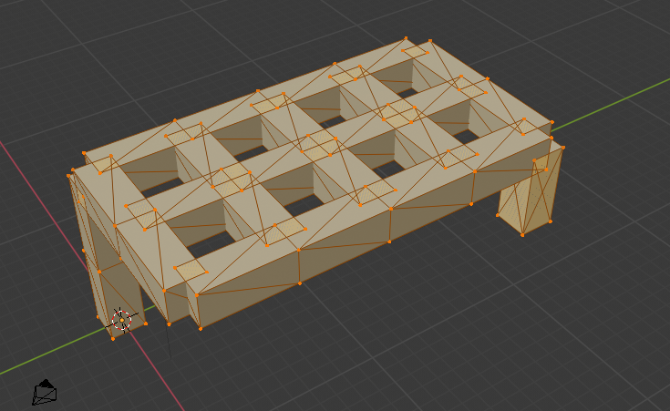

# Code

```{r echo=TRUE, message=F}
require(stringr)
source("../shapevol1/R/sgene.R")
source("../shapevol1/R/genetostl.R")
```


# Genes in the seed:

The seed I'm working with is an adaptation of figure 4 in the paper, but with a square section. Thus we can define `group1` in the seed as:


```{r echo=TRUE, message=FALSE}

gene01 <- sgene("Cross section","Square",status = T,start=-40,stop=40,dom=1)
gene02 <- sgene("Length",       5       ,status = T,start=-40,stop=40,dom=1)
gene03 <- sgene("Diameter",     1       ,status = T,start=-40,stop=40,dom=0)
group1 <- rbind(gene01,gene02,gene03)
```


First thing is to grow a leg. We've set the dominance to 50 here to make sure it gets parsed first - this is labelled `group2`: 

```{r}
gene04 <- sgene("X_1Z",          0,status = T,start=0,stop=5,dom=50)
gene05 <- sgene("Y_1Z",          0,status = T,start=0,stop=5,dom=50)
gene06 <- sgene("Z_1Z",          1,status = T,start=0,stop=5,dom=50)
group2 <- rbind(gene04,gene05,gene06)
```

This can be rendered as follows: 

```{r echo=TRUE, message=F}
genetostlfile3   ("~/Desktop/stl/seedXg2.stl",rbind(group1,group2),runlim=10)
```


OK, That grows the leg - let's now add group 3 and see what happens. This group of genes can make most of the top of the table. The gene for the opposite leg is listed first, then the remaining : 

```{r echo=TRUE, message=T}
gene13 <- sgene("X_2Z",         -1,status = T,start=-15,stop=10,dom=46)
gene14 <- sgene("Y_2Z",          0,status = T,start=-15,stop=10,dom=46)
gene15 <- sgene("Z_2Z",          0,status = T,start=-15,stop=10,dom=46)

gene16 <- sgene("X_2X",          1,status = T,start=0,stop=8,dom=48)
gene17 <- sgene("Y_2X",          0,status = T,start=0,stop=8,dom=48)
gene18 <- sgene("Z_2X",          0,status = T,start=0,stop=8,dom=48)

gene19 <- sgene("X_2Y",          1,status = T,start=0,stop=15,dom=48)
gene20 <- sgene("Y_2Y",          0,status = T,start=0,stop=15,dom=48)
gene21 <- sgene("Z_2Y",          0,status = T,start=0,stop=15,dom=48)
group3 <- rbind(gene13,gene14,gene15,gene16,gene17,gene18,gene19,gene20,gene21)
```


This gives the following shape. The second leg (on the right of the image) is one unit too short! This is because the position is oscillating between 20,10,10 and 20,10,5 due to the start and stop values of `gene6` and `gene13`. 




