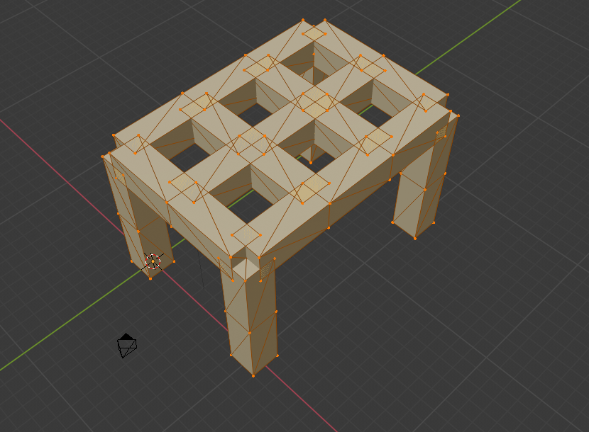
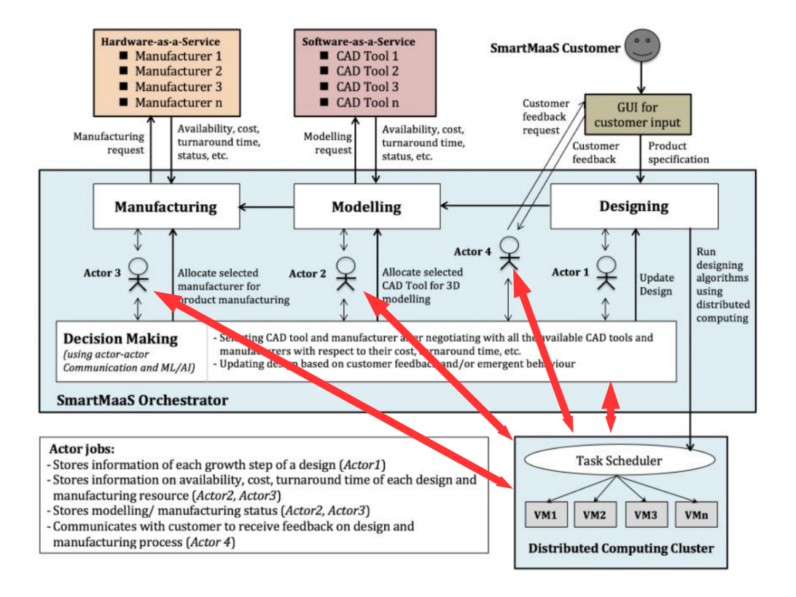

```{r setup, include=FALSE}
knitr::opts_chunk$set(echo = FALSE)
```


## Summary

- Algorithm for 'growing' a set of seed genes
- Strengths and weaknesses
- Comparision with L-Systems and CPPNs
- Novelty search

## Target Shape





## Gene set
<small>
```{r, echo=T, eval=F}
gene01 <- sgene("Cross section","Square",status = T,start=-40,stop=40,dom=1)
gene02 <- sgene("Length",         5,status = T,start=-40,stop= 40,dom= 1)
gene03 <- sgene("Diameter",       1,status = T,start=-40,stop= 40,dom= 0)

gene04 <- sgene("X_1X",           0,status = T,start=  0,stop=  1,dom=50)
gene05 <- sgene("Y_1Y",           0,status = T,start=  0,stop=  1,dom=50)
gene06 <- sgene("Z_1Z",           1,status = T,start=  0,stop=  5,dom=50)

gene16 <- sgene("T1_2X",          1,status = T,start=  0,stop=  5,dom=48)
gene17 <- sgene("T2_2Y",          1,status = T,start=  0,stop= 10,dom=48)
gene18 <- sgene("T1_2Z",          0,status = T,start=  0,stop= 15,dom=48)

gene19 <- sgene("T3_2X",          1,status = T,start=  0,stop=  1,dom=47)
gene20 <- sgene("T3_2Y",          0,status = T,start= 15,stop= 16,dom=47)
gene21 <- sgene("T3_2Z",         -1,status = T,start=  6,stop= 10,dom=47)

gene22 <- sgene("T4_2X",          0,status = T,start= 10,stop= 11,dom=46)
gene23 <- sgene("T4_2Y",          1,status = T,start=  0,stop=  4,dom=46)
gene24 <- sgene("T4_2Z",         -1,status = T,start=  6,stop= 10,dom=46)

gene25 <- sgene("T5_2X",          0,status = T,start= 10,stop= 11,dom=45)
gene26 <- sgene("T5_2Y",          1,status = T,start=  4,stop= 14,dom=45)
gene27 <- sgene("T5_2Z",          0,status = T,start=  6,stop= 10,dom=45)

gene28 <- sgene("T6_2X",          1,status = T,start=  5,stop=  9,dom=44)
gene29 <- sgene("T6_2Y",          0,status = T,start= 11,stop= 15,dom=44)
gene30 <- sgene("T6_2Z",          0,status = T,start=  6,stop= 10,dom=44)

gene31 <- sgene("L3_2X",          0,status = T,start=  0,stop=100,dom=43)
gene32 <- sgene("L3_2Y",          0,status = T,start=  0,stop= 15,dom=43)
gene33 <- sgene("L3_2Z",         -1,status = T,start=  1,stop= 12,dom=43)

gene34 <- sgene("L4_2X",          0,status = T,start= 10,stop= 11,dom=51)
gene35 <- sgene("L4_2Y",          0,status = T,start=15,stop=  16,dom=51)
gene36 <- sgene("L4_2Z",         -1,status = T,start= 1,stop=  10,dom=51)
```
</small>


## Algorithm pseudocode

<small>
```{r, echo=TRUE, eval = FALSE}
genetostlfile4 <- function(fn="shape.stl",genes,pos=spos(0,0,0),runlim=1000){
  iterations <- 0
  while (TRUE)
    posnext <- NULL
    for(pp in 1:nrow(pos)){
      
      shape <- getshape(pos[pp,],genes)
      domval <- domInZone(pos[pp,],genes)
      if(domval){
        
        dirs <- genes[genes$dom == domval & dirs$valtyp!=0,] # extract domlevel
        for(dd in 1:nrow(dirs)){
          direction <- get_direction(dirs)
          posnext <- addposition(dirs[dd],shape,direction,posnext)
          drawCStoSTL(pos[pp,],shape,direction)
    
    if(is.null(posnext) | iterations++ > runlim)      
      break
    
    pos <- posnext
```
</small>


## Seed genes

- No need for active "status flag" in this version
- Dominance effects - branching *has* to be at same level. Not sure if this is a problem yet!

novelty search as a means of measuring the "expressive power" of an encoding


## Strengths & Weaknesses


- Very flexible *and readable*
- Compatible with engineering platforms

- Arbitrary start/stop points
- Not particularly compact
- X,Y,Z zones are only loosely joined

- *Gradient* aspects loosely implemented via 'zoning'
- *Grammar* aspects in a combination of dominance/ gene triplets


## Grammars vs Gradients

Grammars - e.g. L-systems
- highly compact
- single start point
- relative coordinate system
- easy to implement stochasticity


***
Gradients - e.g. CPPNs
- 


## Challenges in EAs


## Novelty search

- Allows us to explore what's possible without a particular target 
- Use Novely as a proxy for a fitness function
- Easy to extend as more data (types) become available to us

How it works in practice

- Initiate an empty list $L$ of novel states
- Generate an initial popuation by mutating a seed (include 1 instance of the unmutated seed)
- For each new individual, gather statistics about the final object
- Add all the new states to the list $L$
- Use some metric to determine which are the 'most novel' - and use this as a fitness function. 

We can do this initially by simply mutating the values in the geneset - but we could also add and delete genes as needed, or initialize randomly


Initial stats will be: 


# fitting this into the SmartMaaS framework





- see figure for when 


NB - *only mutatin


- Replace the least novel in the population with mutations of the most novel


